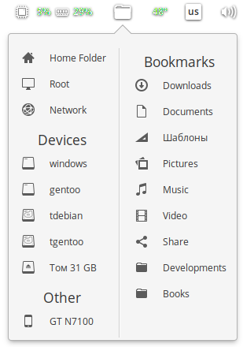

# Wingpanel Places Indicator

Manage disks, volumes, places from the panel

    

  

## For Debian

When mounting volumes, problems with access rights are possible.
My decision /usr/share/polkit-1/actions/org.freedesktop.UDisks2.policy:

    <action id="org.freedesktop.udisks2.filesystem-mount-system"\>  
        ...  
        <defaults\>  
            <allow_any>yes</allow_any\>  
            <allow_inactive>yes</allow_inactive\>  
            <allow_active>yes</allow_active\>  
        </defaults>  
    </action\>

## Building and Installation

You'll need the following dependencies to build:
* valac
* libgtk-3-dev
* libgranite-dev
* libwingpanel-2.0-dev
* meson

## How To Build

    meson build --prefix=/usr
    ninja -C build
    sudo ninja -C build install
